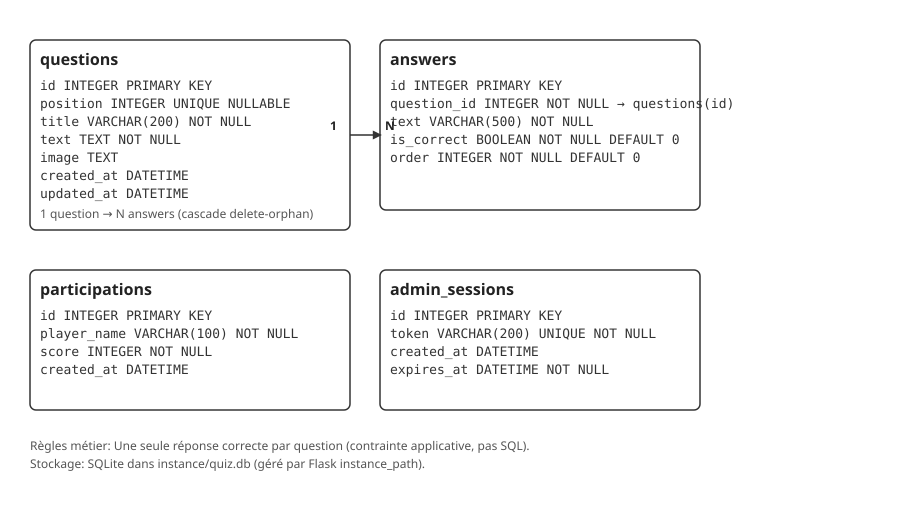

# Qrious - Full Stack (Flask + Vue 3)

Application de quiz complète développée avec Flask (API) et Vue 3 (Frontend) dans le cadre du projet ESIEE 2025.

## 🎯 Fonctionnalités

### Front-Office (Public)
- ✅ Page d'accueil avec meilleurs scores
- ✅ Saisie nom du joueur  
- ✅ Interface de questions avec progression
- ✅ Affichage des résultats et classement
- ✅ Navigation fluide avec Vue Router

### Back-Office (Admin)
- ✅ Authentification par mot de passe (`iloveflask`)
- ✅ Gestion complète des questions (CRUD)
- ✅ Upload d'images en base64
- ✅ Suppression des participations
- ✅ Interface admin responsive
- ✅ Support LaTeX pour équations mathématiques

## 📐 Support LaTeX

L'application supporte l'intégration d'équations mathématiques en LaTeX dans les questions et réponses.

### Utilisation

#### Syntaxe de base

- **Math inline** : Utilisez `$...$` pour des équations dans le texte
  - Exemple : `$E = mc^2$` → E = mc²
  - Exemple : `La formule $x^2 + y^2 = r^2$ représente un cercle`

- **Math en bloc** : Utilisez `$$...$$` pour des équations centrées
  - Exemple : `$$\int_0^1 x dx = \frac{1}{2}$$`
  - Les équations en bloc sont centrées et prennent leur propre ligne

#### Exemples courants

| Syntaxe LaTeX | Résultat |
|--------------|----------|
| `$\frac{a}{b}$` | Fraction a/b |
| `$x^2 + y^2$` | Puissances |
| `$\sqrt{x}$` | Racine carrée |
| `$\sqrt[n]{x}$` | Racine n-ième |
| `$\sum_{i=1}^{n} i$` | Somme |
| `$\int_0^1 f(x) dx$` | Intégrale |
| `$\alpha, \beta, \gamma$` | Lettres grecques |

#### Fonctionnalités

- **Aperçu en temps réel** : Lors de la création/édition d'une question, un aperçu LaTeX s'affiche automatiquement sous les champs de texte
- **Aide intégrée** : Section d'aide collapsible dans l'éditeur de questions avec exemples et syntaxe
- **Rendu côté client** : Utilisation de KaTeX pour un rendu rapide et performant
- **Support complet** : Fonctionne dans le texte des questions et dans les réponses

#### Documentation

Pour la liste complète des fonctions LaTeX supportées, consultez la [documentation KaTeX](https://katex.org/docs/supported.html).

### Dépannage

- **Les équations ne s'affichent pas** : Vérifiez que les délimiteurs `$` ou `$$` sont correctement placés
- **Erreur de rendu** : Consultez la console du navigateur pour les détails de l'erreur LaTeX
- **Syntaxe invalide** : En cas d'erreur, le texte LaTeX original sera affiché au lieu de l'équation

## 🛠 Technologies

### Backend
- **Flask 3.1.2** - Framework web Python
- **SQLAlchemy** - ORM pour base de données
- **SQLite** - Base de données
- **PyJWT** - Authentification JWT
- **Flask-CORS** - Support CORS

### Frontend  
- **Vue 3** - Framework JavaScript
- **Vite** - Build tool et dev server
- **Vue Router** - Navigation
- **Tailwind CSS** - Framework CSS
- **Axios** - Client HTTP
- **KaTeX** - Rendu LaTeX pour équations mathématiques

## 🚀 Installation et Lancement

### Prérequis
- Python 3.9+
- Node.js LTS
- Docker (optionnel)

### Backend (API)
```bash
cd quiz-api
python -m venv venv
venv\Scripts\Activate.ps1  # Windows
source venv/bin/activate   # Linux/Mac
pip install -r requirements.txt
python app.py
```
→ API disponible sur http://localhost:5000

### Frontend (UI)
```bash
cd quiz-ui/quiz-app
npm install
npm run dev
```
→ Interface disponible sur http://localhost:5173

## 🐳 Docker

### Images locales
```bash
# API
cd quiz-api
docker build -t quiz-local-api .
docker run -p 5000:5000 quiz-local-api

# Frontend
cd quiz-ui/quiz-app
docker build -t quiz-local-ui .
docker run -p 3000:80 quiz-local-ui
```

### Images de production
```bash
# API
docker build -t ssssssss3/quiz-prod-api .

# Frontend
docker build -t ssssssss3/quiz-prod-ui -f Dockerfile.prod .
```

### Images Docker publiques
- `ssssssss3/quiz-prod-api:latest` → https://hub.docker.com/r/ssssssss3/quiz-prod-api/tags
- `ssssssss3/quiz-prod-ui:latest` → https://hub.docker.com/r/ssssssss3/quiz-prod-ui/tags

Pull rapide:
```bash
docker pull ssssssss3/quiz-prod-api:latest
docker pull ssssssss3/quiz-prod-ui:latest
```

Exécution rapide:
```bash
# API
docker run -d --name quiz-prod-api -p 5000:5000 ssssssss3/quiz-prod-api:latest

# UI (avec proxy /api)
# Place ce fichier nginx-ui.conf à la racine du projet puis:
# server { ... proxy_pass http://host.docker.internal:5000/; ... }
docker run -d --name quiz-prod-ui -p 8080:80 \
  -v %CD%\\nginx-ui.conf:/etc/nginx/conf.d/default.conf \
  ssssssss3/quiz-prod-ui:latest
```

## 📊 API Endpoints

### Publics
- `GET /` - Health check
- `GET /quiz-info` - Infos quiz + scores
- `GET /questions/{id}` - Question par ID
- `GET /questions?position={p}` - Question par position
- `POST /participations` - Soumission réponses

### Authentification
- `POST /login` - Connexion admin

### Admin (JWT requis)
- `POST /questions` - Créer question
- `PUT /questions/{id}` - Modifier question  
- `DELETE /questions/{id}` - Supprimer question
- `DELETE /questions/all` - Supprimer toutes questions
- `DELETE /participations/all` - Supprimer participations

## 🔑 Configuration

### Variables d'environnement
- `SECRET_KEY` - Clé secrète Flask (défaut: dev-secret-key)
- `ADMIN_PASSWORD` - Mot de passe admin (défaut: iloveflask)
- `VITE_API_URL` - URL API pour frontend (défaut: http://localhost:5000)

## 📁 Structure du projet

```
├── context-engineering/     # Documentation et plans
│   ├── ActionPlans/         # Plans d'action détaillés
│   ├── PRD.md              # Product Requirements Document
│   └── ProgressLog.md      # Journal de progression
├── quiz-api/               # Backend Flask
│   ├── models.py           # Modèles SQLAlchemy
│   ├── auth.py             # Authentification JWT
│   ├── app.py              # Application principale
│   ├── Dockerfile          # Image Docker
│   └── requirements.txt    # Dépendances Python
└── quiz-ui/quiz-app/       # Frontend Vue 3
    ├── src/
    │   ├── views/          # Pages Vue
    │   ├── services/       # Services API
    │   └── router/         # Configuration routes
    ├── Dockerfile          # Image Docker dev
    ├── Dockerfile.prod     # Image Docker prod
    └── package.json        # Dépendances npm
```

## 🧪 Tests

### Tests unitaires (Vitest)

Les tests unitaires couvrent les services et composants principaux du frontend.

```bash
cd quiz-ui
npm test              # Mode watch
npm run test:run      # Exécution unique
npm run test:ui       # Interface graphique
```

**Fichiers de test :**

- **`src/test/services/QuizApiService.test.js`** (18 tests)
  - Tests des endpoints API (GET, POST, PUT, DELETE)
  - Gestion des erreurs et intercepteurs
  - Logique de retry automatique
  - Authentification avec tokens JWT

- **`src/test/services/NotificationService.test.js`** (16 tests)
  - Ajout/suppression de notifications
  - Types de notifications (success, error, warning, info)
  - Auto-suppression après timeout
  - Gestion des erreurs API

- **`src/test/components/QuestionDisplay.test.js`** (19 tests)
  - Rendu des questions (titre, texte, image)
  - Intégration LaTeX avec LatexRenderer
  - Sélection et émission d'événements
  - Navigation clavier (Tab, Enter, Space)
  - Attributs ARIA pour l'accessibilité

- **`src/test/components/ImageUpload.test.js`** (17 tests)
  - Validation de taille et type de fichier
  - Compression d'images
  - Prévisualisation
  - Gestion des erreurs de chargement

**Total : 70 tests unitaires**

### Tests manuels

Pour des tests manuels complémentaires :
1. Démarrer backend et frontend
2. Naviguer sur http://localhost:5173
3. Tester parcours joueur complet
4. Tester interface admin (/admin)

## 📝 Base de données

### Modèle
- **questions**: id (PK), position (unique, nullable), title (200, requis), text (requis), image (base64, optionnel), created_at, updated_at
- **answers**: id (PK), question_id (FK -> questions.id), text (500, requis), is_correct (bool), order (int, défaut 0)
- **participations**: id (PK), player_name (100, requis), score (int, requis), created_at
- **admin_sessions**: id (PK), token (200, unique), created_at, expires_at

Relations:
- 1 **question** → N **answers** (cascade delete-orphan)
- Une seule réponse correcte par question (contrainte logique côté API)

Stockage:
- SQLite dans `instance/quiz.db` (chemin géré par Flask, cf. `app.py`).

### Schéma détaillé


Voir `docs/db-schema.md` pour la description complète (champs, contraintes et diagramme).

### Données d'exemple
La base est vide par défaut. Utilisez les endpoints admin (`/login`, `/questions`, `/rebuild-db`) pour créer/initialiser les questions.

## 🎨 Design

Interface utilisant Tailwind CSS avec:
- Design responsive mobile-first
- Palette de couleurs cohérente
- Animations et transitions fluides
- Composants accessibles

## 📋 Validation

- ✅ Endpoints API conformes aux specs
- ✅ Interface utilisateur complète
- ✅ Authentification sécurisée
- ✅ Gestion d'erreurs robuste
- ✅ Images Docker fonctionnelles
- ✅ Tests de validation réussis

## 👥 Équipe

Développé par Ilyas Ghandaoui dans le cadre du projet Full Stack ESIEE 2025.

## 📄 Licence

Projet académique - ESIEE Paris 2025