# 📚 Rapport Complet CI/CD Local - Qrious Quiz Application

## 📋 Table des Matières

1. [Introduction](#introduction)
2. [Vue d'Ensemble de l'Architecture](#vue-densemble-de-larchitecture)
3. [Composants du Pipeline CI/CD](#composants-du-pipeline-cicd)
4. [GitHub Actions - Intégration Continue](#github-actions---intégration-continue)
5. [Docker Hub - Registre d'Images](#docker-hub---registre-dimages)
6. [Kubernetes (Minikube) - Déploiement Local](#kubernetes-minikube---déploiement-local)
7. [Scripts d'Automatisation](#scripts-dautomatisation)
8. [Flux de Travail Complet](#flux-de-travail-complet)
9. [Diagrammes Mermaid](#diagrammes-mermaid)
10. [Configuration et Sécurité](#configuration-et-sécurité)
11. [Commandes Utiles](#commandes-utiles)
12. [Évolutions Futures](#évolutions-futures)

---

## Introduction

Ce rapport détaille l'architecture **CI/CD (Continuous Integration / Continuous Deployment)** mise en place pour l'application **Qrious Quiz**. Cette architecture permet d'automatiser entièrement le cycle de développement, depuis le push du code jusqu'au déploiement sur un cluster Kubernetes local.

### Objectifs du Pipeline CI/CD

| Objectif | Description |
|----------|-------------|
| **Automatisation** | Réduire les interventions manuelles dans le processus de déploiement |
| **Qualité** | Exécuter des tests automatiques avant chaque déploiement |
| **Rapidité** | Déployer les nouvelles versions en quelques minutes |
| **Fiabilité** | Garantir des déploiements reproductibles et cohérents |
| **Traçabilité** | Suivre chaque version déployée via les tags Docker |

---

## Vue d'Ensemble de l'Architecture

L'architecture CI/CD est composée de **4 couches principales** :

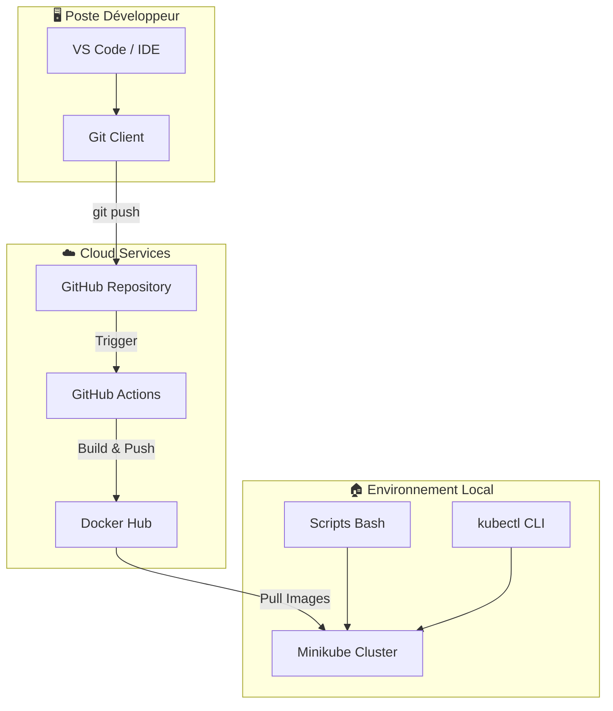

### Technologies Utilisées

| Technologie | Version | Rôle |
|-------------|---------|------|
| **GitHub Actions** | v4 | CI/CD Pipeline (cloud) |
| **Docker** | 4.x+ | Conteneurisation |
| **Docker Hub** | - | Registre d'images |
| **Kubernetes** | 1.34+ | Orchestration de conteneurs |
| **Minikube** | 1.37+ | Cluster K8s local |
| **Node.js** | 20 | Runtime pour tests frontend |
| **Python** | 3.9 | Backend Flask API |

---

## Composants du Pipeline CI/CD

### Architecture des Fichiers

```
📁 Projet-Full-Stack-ESIEE-2025-Ilyas-Cyprien
├── 📁 .github/workflows/
│   └── 📄 ci-cd.yml              # Workflow GitHub Actions
├── 📁 k8s/
│   ├── 📄 configmap.yaml         # Variables d'environnement
│   ├── 📄 secrets.yaml           # Secrets encodés base64
│   ├── 📄 backend-deployment.yaml # API Flask
│   ├── 📄 frontend-deployment.yaml # Frontend Vue.js
│   └── 📄 pvc.yaml               # Persistent Volume Claim
├── 📁 scripts/
│   ├── 📄 start-cd.sh            # Setup complet
│   ├── 📄 setup-minikube.sh      # Configuration Minikube
│   ├── 📄 deploy.sh              # Déploiement K8s
│   └── 📄 auto-deploy.sh         # Watcher auto-déploiement
├── 📁 quiz-api/
│   └── 📄 Dockerfile             # Image backend
└── 📁 quiz-ui/
    └── 📄 Dockerfile.k8s         # Image frontend
```

---

## GitHub Actions - Intégration Continue

### Description du Workflow

Le fichier `.github/workflows/ci-cd.yml` définit le pipeline d'intégration continue qui s'exécute automatiquement à chaque push sur les branches `main` ou `master`.

### Jobs du Pipeline

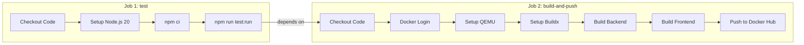

### Détail des Étapes

#### Job `test` - Tests Unitaires

| Étape | Action | Description |
|-------|--------|-------------|
| 1 | `actions/checkout@v4` | Clone le repository |
| 2 | `actions/setup-node@v4` | Configure Node.js 20 avec cache npm |
| 3 | `npm ci` | Installation propre des dépendances |
| 4 | `npm run test:run` | Exécution des 63 tests Vitest |

#### Job `build-and-push` - Construction des Images

| Étape | Action | Description |
|-------|--------|-------------|
| 1 | `docker/login-action@v3` | Authentification Docker Hub |
| 2 | `docker/setup-qemu-action@v3` | Émulation multi-architecture |
| 3 | `docker/setup-buildx-action@v3` | Builder Docker avancé |
| 4-5 | `docker/build-push-action@v5` | Build et push des images |

### Configuration YAML Complète

```yaml
name: CI/CD Pipeline

on:
  push:
    branches: [main, master]
  pull_request:
    branches: [main, master]

jobs:
  test:
    name: Unit Tests
    runs-on: ubuntu-latest
    steps:
      - uses: actions/checkout@v4
      - uses: actions/setup-node@v4
        with:
          node-version: '20'
          cache: 'npm'
          cache-dependency-path: quiz-ui/package-lock.json
      - run: npm ci
        working-directory: quiz-ui
      - run: npm run test:run
        working-directory: quiz-ui

  build-and-push:
    needs: test
    runs-on: ubuntu-latest
    if: github.event_name == 'push'
    steps:
      # Build multi-architecture images
      # Push to Docker Hub with tags: latest + SHA
```

---

## Docker Hub - Registre d'Images

### Images Produites

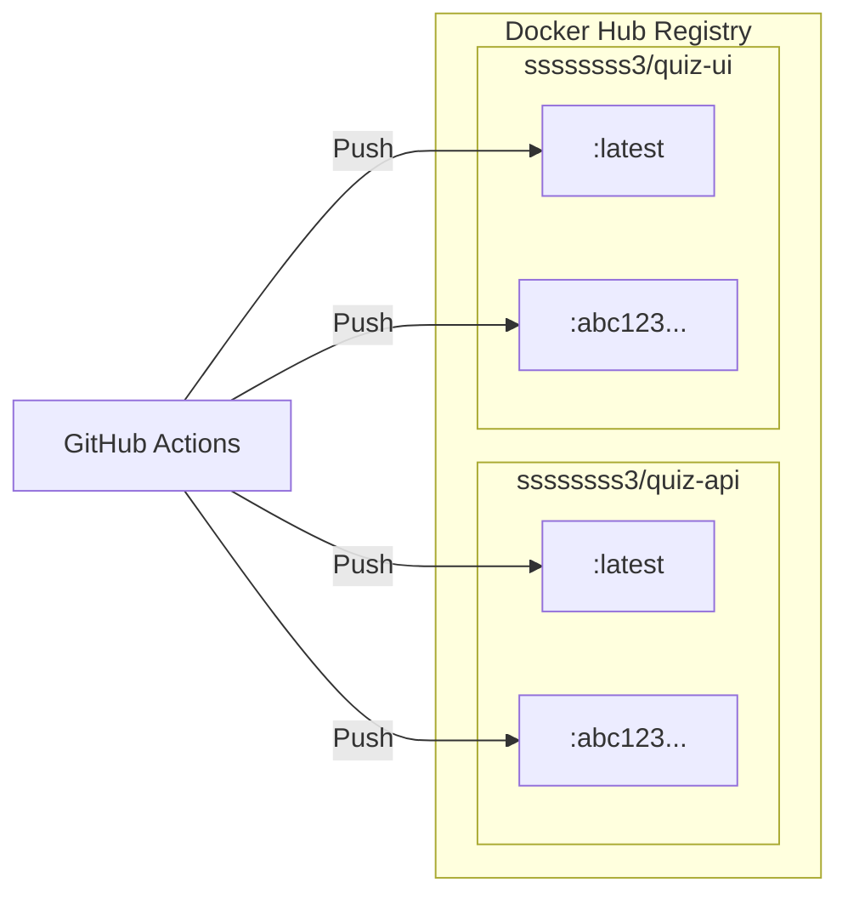

### Spécifications des Images

| Image | Base Image | Architectures | Contenu |
|-------|------------|---------------|---------|
| `quiz-api` | `python:3.9-alpine` | amd64, arm64 | Flask + Gunicorn (4 workers) |
| `quiz-ui` | `nginx:alpine` | amd64, arm64 | Vue 3 + Vite + Nginx proxy |

### Dockerfile Backend (quiz-api)

```dockerfile
FROM python:3.9-alpine
WORKDIR /app
COPY requirements.txt .
RUN pip install --no-cache-dir -r requirements.txt
COPY . .
EXPOSE 5000
CMD ["gunicorn", "-w", "4", "-b", "0.0.0.0:5000", "app:app"]
```

### Dockerfile Frontend (quiz-ui/Dockerfile.k8s)

```dockerfile
# Stage 1: Build
FROM node:lts-alpine AS build
WORKDIR /app
COPY package*.json ./
RUN npm install
COPY . .
RUN npm run build

# Stage 2: Serve with Nginx
FROM nginx:alpine
COPY --from=build /app/dist /usr/share/nginx/html
COPY nginx.conf /etc/nginx/conf.d/default.conf
EXPOSE 80
```

---

## Kubernetes (Minikube) - Déploiement Local

### Architecture du Cluster

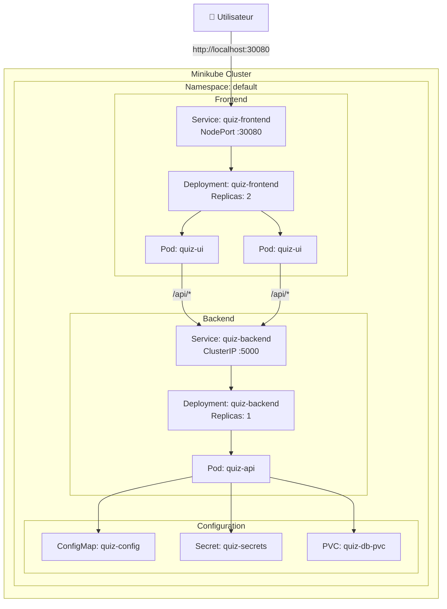

### Manifests Kubernetes

#### ConfigMap (`k8s/configmap.yaml`)

Variables d'environnement non sensibles :

```yaml
apiVersion: v1
kind: ConfigMap
metadata:
  name: quiz-config
data:
  FLASK_ENV: "production"
  FLASK_DEBUG: "0"
  VITE_API_URL: "http://quiz-backend:5000"
```

#### Secrets (`k8s/secrets.yaml`)

Données sensibles encodées en base64 :

```yaml
apiVersion: v1
kind: Secret
metadata:
  name: quiz-secrets
type: Opaque
data:
  SECRET_KEY: ZGV2LXNlY3JldC1rZXktY2hhbmdlLWluLXByb2R1Y3Rpb24=
  ADMIN_PASSWORD: aWxvdmVmbGFzaw==
```

#### Backend Deployment

| Paramètre | Valeur |
|-----------|--------|
| Replicas | 1 (SQLite = single writer) |
| Image | `ssssssss3/quiz-api:latest` |
| Port | 5000 |
| Service Type | ClusterIP |
| Resources | 128Mi-512Mi RAM, 100m-500m CPU |
| Volume | PVC pour SQLite |

#### Frontend Deployment

| Paramètre | Valeur |
|-----------|--------|
| Replicas | 2 |
| Image | `ssssssss3/quiz-ui:latest` |
| Port | 80 |
| Service Type | NodePort (30080) |
| Resources | 64Mi-256Mi RAM, 50m-200m CPU |

### Health Checks (Probes)

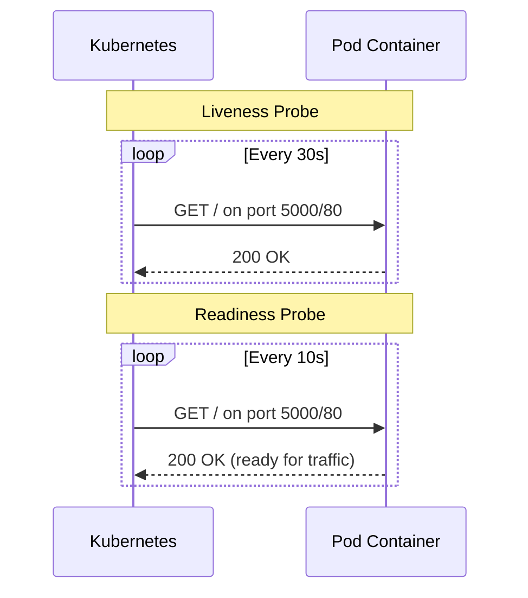

---

## Scripts d'Automatisation

### Vue d'ensemble des Scripts

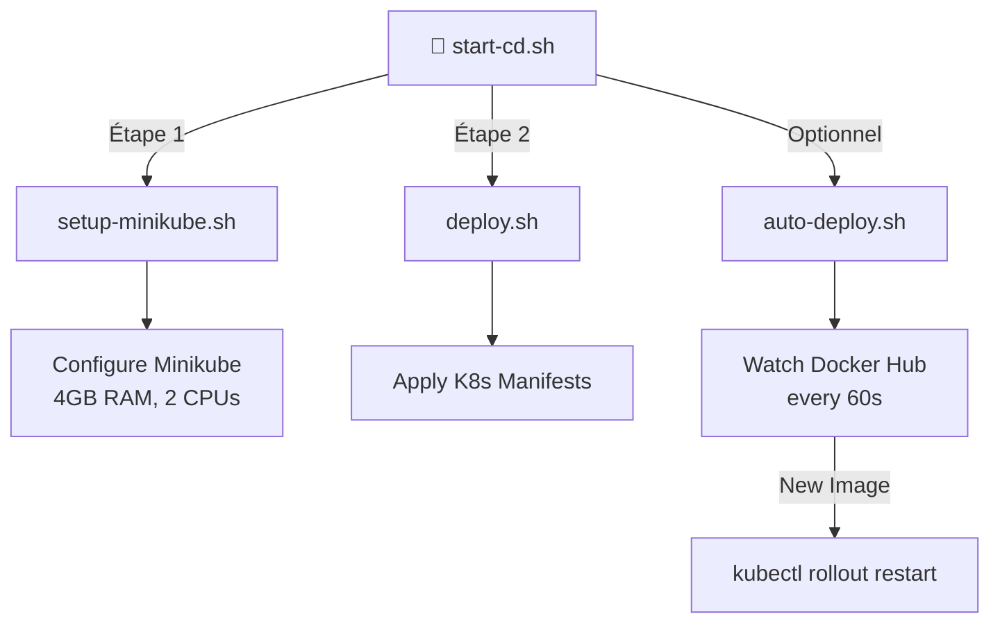

### Script `start-cd.sh`

**But**: Point d'entrée unique pour initialiser tout l'environnement CD.

**Fonctionnement**:
1. Appelle `setup-minikube.sh` pour démarrer le cluster
2. Appelle `deploy.sh` pour déployer l'application
3. Affiche l'URL d'accès à l'application

```bash
#!/bin/bash
# Step 1: Setup Minikube
./scripts/setup-minikube.sh

# Step 2: Deploy Application
export DOCKERHUB_USERNAME="ssssssss3"
./scripts/deploy.sh

# Step 3: Display Access URL
minikube service quiz-frontend --url
```

### Script `setup-minikube.sh`

**But**: Configurer et démarrer Minikube avec les ressources optimales.

**Configuration**:

| Paramètre | Valeur |
|-----------|--------|
| Driver | docker |
| Memory | 4096 MB |
| CPUs | 2 |
| Disk | 20 GB |
| Kubernetes | stable |

**Addons activés**:
- `metrics-server` - Métriques de ressources
- `dashboard` - Interface web K8s

### Script `deploy.sh`

**But**: Déployer l'application sur Kubernetes.

**Étapes**:
1. Vérifie que Minikube est actif
2. Crée un dossier temporaire pour les manifests modifiés
3. Remplace les placeholders avec le username Docker Hub
4. Applique les manifests dans l'ordre : ConfigMap → Secrets → Backend → Frontend
5. Attend le rollout complet des deployments
6. Affiche le statut et l'URL

### Script `auto-deploy.sh`

**But**: Surveillance automatique de Docker Hub pour détecter les nouvelles images.

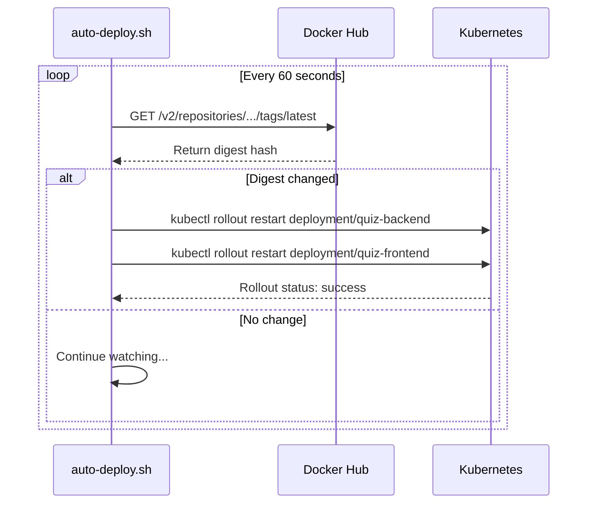

**Fonctionnement**:
1. Interroge l'API Docker Hub toutes les 60 secondes
2. Compare le digest de l'image avec la version précédente
3. Si changement détecté → `kubectl rollout restart`
4. Attend le rollout complet avant de continuer

---

## Flux de Travail Complet

### Diagramme de Séquence CI/CD

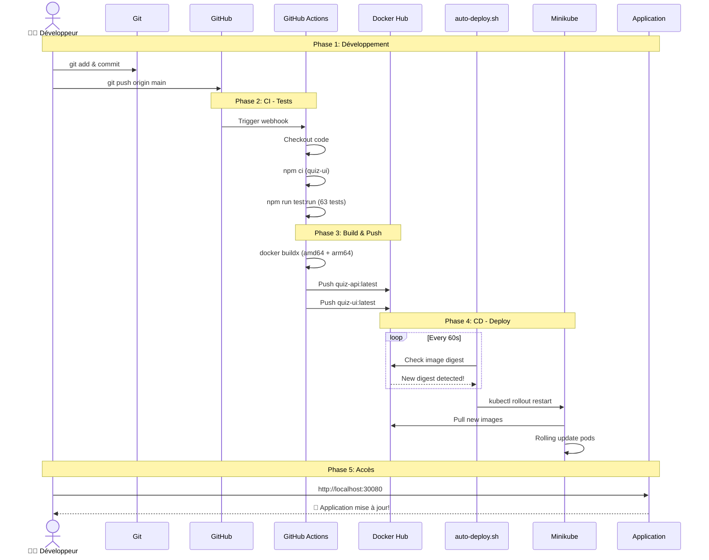

### Temps Estimés par Phase

| Phase | Durée Estimée |
|-------|---------------|
| Tests Vitest | ~30 secondes |
| Build Docker multi-arch | ~3-5 minutes |
| Push Docker Hub | ~1 minute |
| Détection auto-deploy | ≤60 secondes |
| Rolling update K8s | ~30 secondes |
| **Total** | **~5-7 minutes** |

---

## Diagrammes Mermaid

### Architecture Globale

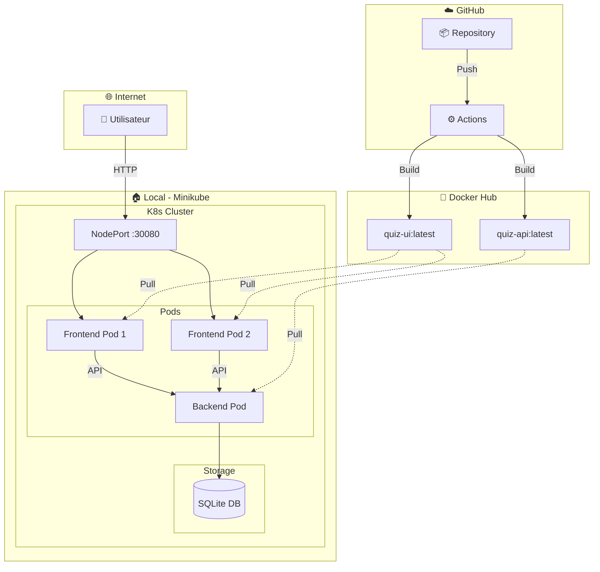

### Flux de Données

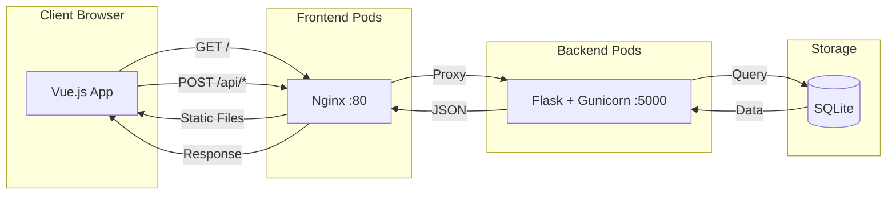

### États du Pipeline

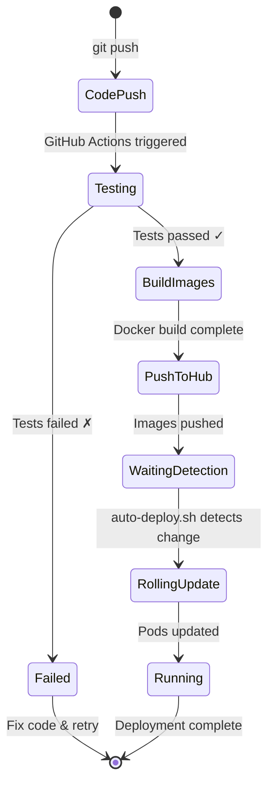

### Cycle de Vie des Pods

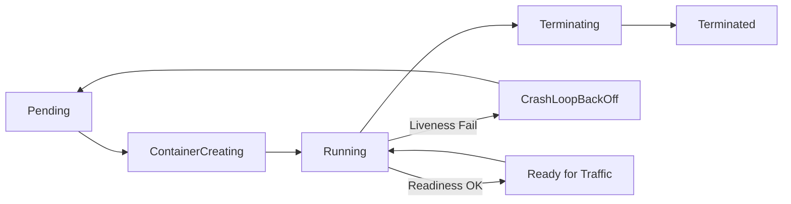

---

## Configuration et Sécurité

### Secrets GitHub Actions

| Secret | Description | Usage |
|--------|-------------|-------|
| `DOCKERHUB_USERNAME` | Nom d'utilisateur Docker Hub | Login + push images |
| `DOCKERHUB_TOKEN` | Token d'accès Docker Hub | Authentification sécurisée |

### Secrets Kubernetes

| Secret | Valeur par défaut | Usage |
|--------|-------------------|-------|
| `SECRET_KEY` | `dev-secret-key-change-in-production` | Clé Flask |
| `ADMIN_PASSWORD` | `iloveflask` | Auth admin API |

### Matrice de Sécurité

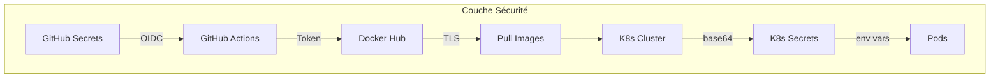

---

## Commandes Utiles

### Démarrage Initial

```bash
# Setup complet (une seule fois)
./scripts/start-cd.sh

# Lancer le watcher auto-deploy (nouveau terminal)
./scripts/auto-deploy.sh
```

### Monitoring

```bash
# Status des pods
kubectl get pods -l app=quiz

# Logs backend en temps réel
kubectl logs -l component=backend -f

# Logs frontend en temps réel  
kubectl logs -l component=frontend -f

# Dashboard Kubernetes (interface web)
minikube dashboard
```

### Redéploiement Manuel

```bash
# Forcer le redéploiement
kubectl rollout restart deployment/quiz-backend
kubectl rollout restart deployment/quiz-frontend

# Voir le status du rollout
kubectl rollout status deployment/quiz-backend
```

### Accès Application

```bash
# Obtenir l'URL du frontend
minikube service quiz-frontend --url

# Résultat: http://127.0.0.1:XXXXX ou http://192.168.x.x:30080
```

### Debug

```bash
# Décrire un pod en erreur
kubectl describe pod <pod-name>

# Exécuter un shell dans un pod
kubectl exec -it <pod-name> -- /bin/sh

# Voir les événements du cluster
kubectl get events --sort-by='.lastTimestamp'
```

---

## Évolutions Futures

### Roadmap

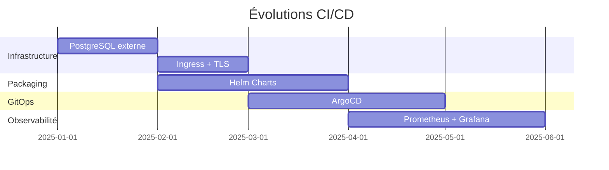

### Améliorations Planifiées

| Amélioration | Priorité | Impact |
|--------------|----------|--------|
| **PostgreSQL externe** | Haute | Scalabilité du backend |
| **Ingress Controller** | Haute | TLS, routing avancé |
| **Helm Charts** | Moyenne | Réutilisabilité, versioning |
| **ArgoCD** | Moyenne | GitOps automatique |
| **Prometheus + Grafana** | Basse | Monitoring avancé |

---

## Conclusion

Cette architecture CI/CD offre un pipeline complet et automatisé pour l'application Qrious Quiz :

✅ **Tests automatiques** avant chaque déploiement  
✅ **Build multi-architecture** (amd64 + arm64)  
✅ **Déploiement automatique** via watcher Docker Hub  
✅ **Scalabilité** avec Kubernetes (replicas, rolling updates)  
✅ **Sécurité** avec secrets chiffrés et tokens  

Le développeur n'a qu'une seule action à effectuer : **`git push`**. Tout le reste est automatisé !

---

*Dernière mise à jour: 28 décembre 2025*
